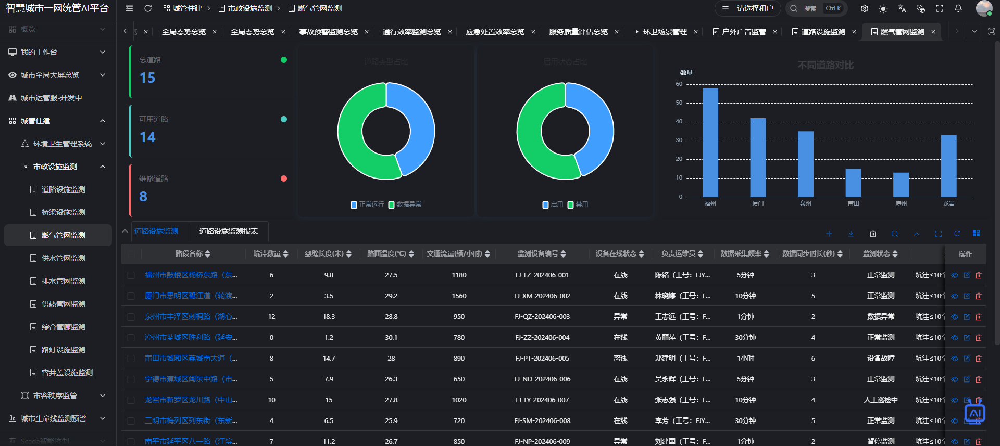

## 🚀 重大更新：前端 UI 上线！（2025年3月25日）

> 从“能跑”到“好看”——我们把前端界面交到你手中，为你提供一些思路！

此前本项目以后端服务为主，许多开发者下载后无法看到实际界面。**本次更新正式发布前端 UI 系统**。
### 📸 看看效果
  

# 亘川智慧城市管理后台

基于 [vue-vben-admin](https://github.com/vbenjs/vue-vben-admin) v5 构建的智慧城市管理前端解决方案，采用 Vue 3 + Vite + Element Plus 技术栈。

## 项目简介

亘川智慧城市管理后台是一套现代化的中后台管理系统，提供完善的用户权限管理、动态路由、数据可视化等功能。代码完全开源，致力于为智慧城市相关应用提供高效、稳定的前端解决方案。

## ✨ 核心改进亮点

- **最新技术栈**：基于 Vue 3.5、Vite 7、TypeScript 5 开发
- **Element Plus**：采用 Element Plus 2.10 作为 UI 组件库
- **TypeScript**：完整类型支持，提高开发效率
- **Pinia 状态管理**：轻量级响应式状态管理方案
- **动态路由**：基于权限的动态菜单和路由生成
- **国际化**：支持多语言切换
- **主题配置**：内置多套主题方案

## 技术栈

| 技术 | 说明 | 版本 |
|------|------|------|
| Vue | 渐进式前端框架 | 3.5.24 |
| Vite | 下一代前端构建工具 | 7.2.2 |
| Element Plus | Vue 3 组件库 | 2.10.2 |
| TypeScript | JavaScript 超集 | 5.9.3 |
| Pinia | 状态管理 | 3.0.3 |
| Vue Router | 路由管理 | 4.5.1 |
| Vue I18n | 国际化 | 11.1.7 |

## 环境要求

- Node.js >= 20.12.0
- pnpm >= 10.22.0（强制使用 pnpm）

## 安装与运行

```bash
# 安装依赖
pnpm install

# 开发模式
pnpm run dev

# 构建生产版本
pnpm run build

# 预览生产版本
pnpm run preview
```

## 项目结构

```
genchuan-smart-city-ui/
├── apps/
│   └── web-ele/          # Element Plus 版本
│       ├── src/          # 源代码
│       ├── public/       # 静态资源
│       └── package.json  # 项目配置
└── ...配置文件
```

## 相关链接

- [Element Plus 文档](https://element-plus.org/zh-CN/)
- [Vite 中文文档](https://cn.vitejs.dev/)
- [Vue 3 文档](https://staging-cn.vuejs.org/)

## 开源协议

MIT License

---
联系我们

### 亘川智城官网

**点击跳转**：http://genchuan.cn

### 企业微信客服
扫描下方二维码，联系我们，进群备注Gitee，获取技术支持与服务。


### 亘川智城SaaS平台

地址：http://cloud.genchuan.cn 
账号密码：请联系我们获取吧

### 公众号
亘川科技


